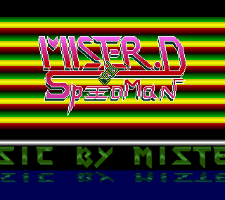

# Amiga
Amiga Demos in 68000 ASM

## First Intro

### Description
My very fist Amiga 500 intro in 1989. Some basic coppers, waving logo and scrolltext. If you are running an emulator, disable all cache and acceleration or the intro will run too fast (lamer vertical sync).

### Launch
- In folder "Mrd1" launch SEKA.
- Choose memory allocation (for example Chip 100K)
- Load the code: "r", then "intro1.s"
- Assemble the code: "a" (no option)
- Load the data binaries (logo, music, font): "y"
- Run the demo: "j r"

